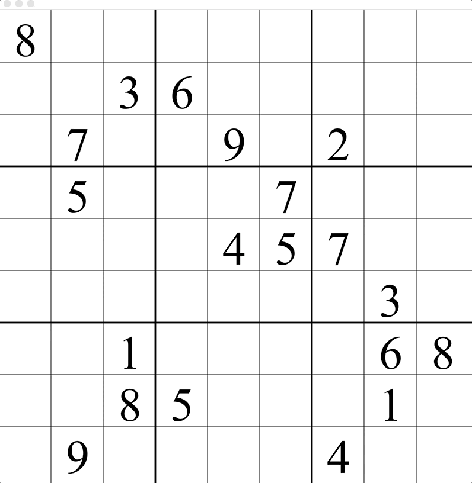

# PseudokuSolver
1. Solves any legal 3x3 sudoku puzzle through backtracking (creates pseudoboards and checks legality).
2. Solves almost all medium and some advanced sudoku puzzles through restriction and logic. 

